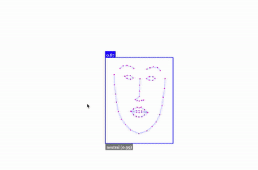

# Realtime Emotion Detector


Realtime emotion detector built with Face API JS library which is an abstraction over tensorflow.


> This project uses tinyFaceDetector model under the hood which is a very light weight library. 
> this project detects faces and emotions directly from the webcam in the browser realtime




How to run:

```sh
$ git clone https://github.com/ranit-geek/Realtime-Emotion-Detector.git
$ cd Realtime-Emotion-Detector
$ npm install http-server -g
$ http-server . -p 1337      # server will up in http://localhost:1337/
```

Live demo : https://face-detector-realtime.herokuapp.com/
Please be patient and wait for sometime to load the models as I am running this demo on Heroku free tier which is sadly not very fast.